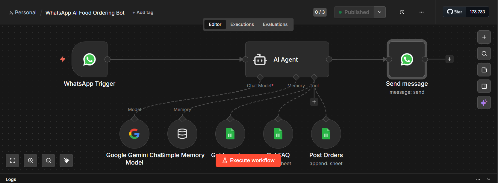
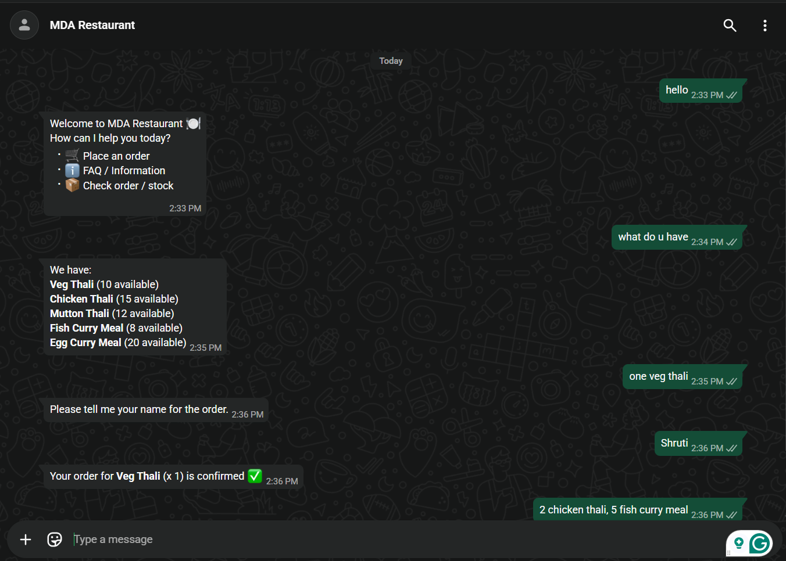

# WhatsApp AI Food Ordering Bot (n8n)

## Overview

This project is a WhatsApp chatbot that allows users to order food through natural language.
It is built using **n8n workflow automation**, **Google Gemini AI**, and **Google Sheets**.

The bot receives messages from WhatsApp, processes them with an AI agent, checks menu and inventory data from Google Sheets, and sends responses back to the user.

---

## Features

* WhatsApp Cloud API integration
* AI-powered conversation using Google Gemini
* Menu and inventory management with Google Sheets
* Automatic order storage
* FAQ support
* Real-time responses via WhatsApp

---

## System Architecture

User → WhatsApp → WhatsApp Cloud API → n8n Workflow
→ AI Agent (Gemini) → Google Sheets → WhatsApp Response

---

## Workflow Components

### WhatsApp Trigger

Receives incoming messages from WhatsApp.

### AI Agent

Processes user messages and determines:

* food order requests
* menu queries
* FAQ questions

### Google Sheets Integration

Used as a lightweight database.

Sheets used:

* **Inventory Sheet** – available food items
* **FAQ Sheet** – common questions
* **Orders Sheet** – stores user orders

### Send Message

Returns the AI response to the user on WhatsApp.

---

## Technologies Used

* n8n
* WhatsApp Cloud API
* Google Gemini API
* Google Sheets API

---

## Installation / Setup

1. Install or open n8n.
2. Import the workflow from:
   `workflow/n8n-workflow.json`
3. Add the required credentials:

   * WhatsApp Cloud API
   * Google Gemini API
   * Google Sheets
4. Activate the workflow.

---

## Example Conversation

User:

> pizza

Bot:

> Great! 🍕 One pizza added to your order.

User:

> what do you have?

Bot:

> Our menu includes Pizza, Burger, Veg Thali, Chicken Momos, and Cold Coffee.

---

## Future Improvements

* Payment gateway integration
* Multi-language support
* Order tracking
* Restaurant dashboard

---

## Workflow

## Demo

---

## Author

Shruti Prasad
